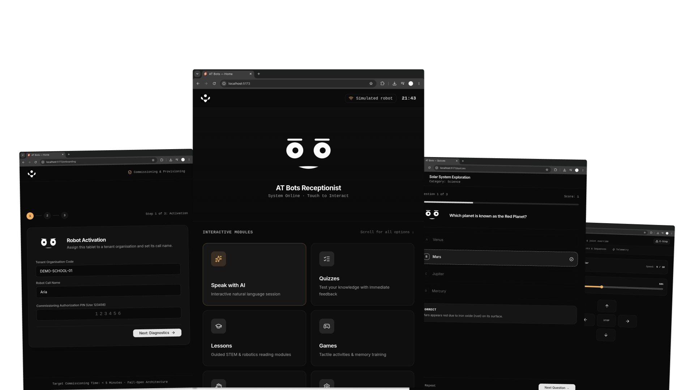
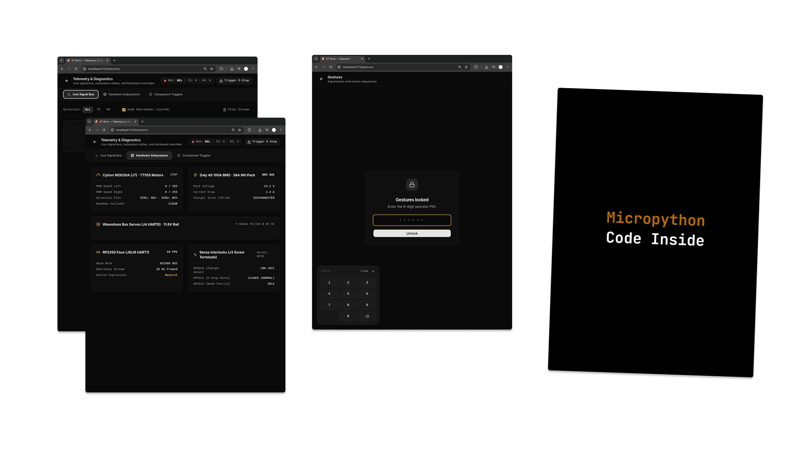
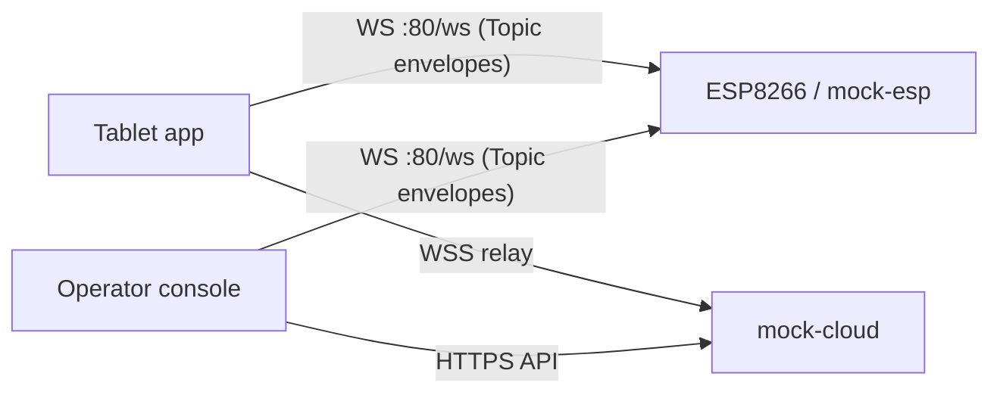

# AT Bots V3 Lite





A working demo of the AT Bots V3 Lite interactive assistant: a visitor-facing tablet
app, an operator console, and a robot control channel — connected over a local
JSON/WebSocket protocol.

This is an **MVP/demo**, not the shipping product. The full design lives in
[`docs/AT_Bots_V3_Lite_Master_Technical_Design_Document.md`](docs/AT_Bots_V3_Lite_Master_Technical_Design_Document.md);
treat that as product context, not the build contract. See
[`AGENTS.md`](AGENTS.md) for scope and conventions.

## What's here

| Path | Purpose |
|---|---|
| `apps/tablet` | Visitor surface — home tiles, AI session, animated face (SvelteKit SPA) |
| `apps/operator` | Operator console — local control + cloud admin/fleet (SvelteKit SPA) |
| `packages/protocol` | Message shapes, type guards, constants — single source of truth |
| `packages/link` | `EspLink`, `WebSocketEspLink`, `MockEspLink`, `RelayClient`, `CloudClient` |
| `mock/esp` | Node WebSocket robot simulator (`:8765`) |
| `mock/cloud` | Node HTTP + WebSocket relay/API stub with a swappable AI provider (`:8787`) |
| `firmware/esp8266` | MicroPython bench prototype: Wi-Fi + WebSocket + drive + telemetry |
| `docs/` | Design document, [`protocol.md`](docs/protocol.md), and [`srs.md`](docs/srs.md) |

## Requirements

- **Node 24 / npm 11** (npm workspaces).
- **Python 3** with a virtualenv — only for the ESP8266 tooling.
- Optional: an ESP8266 board on `/dev/ttyUSB0`.

## Quick start

```bash
npm install

# terminal 1 — mock cloud (AI relay + API)
npm run dev:cloud

# terminal 2 — visitor app
npm run dev:tablet
```

Open <http://localhost:5173>.

The tablet defaults to the **simulated robot**, so no hardware is needed. To use the
real board: **Settings → Robot link → ESP8266 over Wi-Fi → `ws://<board-ip>/ws`**.

## Commands

| Command | Description |
|---|---|
| `npm run dev:all` | Run all services simultaneously (cloud, esp, tablet, operator) |
| `npm run dev:tablet` | Visitor app (`:5173`) |
| `npm run dev:operator` | Operator console (`:5174` if the tablet is running) |
| `npm run dev:esp` | Robot simulator (`:8765`) |
| `npm run dev:cloud` | Mock relay + API (`:8787`) |
| `npm run build` | Build both apps |
| `npm run check` | `svelte-check` both apps |
| `npm test` | Vitest (protocol guards + link behaviour) |
| `npm run typecheck` | Typecheck `packages/*` and `mock/*` |
| `npm run format` / `format:check` | Prettier |

## How it fits together



- **Topic & Payload Envelopes over WebSocket.** The ESP is the local hub; both apps connect to it using standardized topics (`cmd/drive`, `telemetry`, `event/say`).
- **Script Mode** routes operator (`cmd/say`) → ESP → tablet (`event/say`); the tablet speaks.
- **Correlated Handshakes:** Requests carry an `id` and await matching `res/ack` confirmations.
- **Heartbeat** 5 Hz (`sys/hb`); **deadman** stops drive 500 ms after the last heartbeat (`event/deadman`).
- The protocol is defined once in `packages/protocol` and documented in
  [`docs/protocol.md`](docs/protocol.md).

## Demo flow

1. Home → **Speak with AI**.
2. Ask a question or tap a canned one — the mock model replies, the face animates,
   and the tablet speaks via the browser's `speechSynthesis`.
3. Switch the robot source to the ESP8266 to drive the real board's telemetry and
   expression state.
4. Operator console: local modes (drive, gestures, Script Mode) and cloud views
   (fleet, content, credits, sessions) backed by the mock API.

> Microphone input uses the Web Speech API, which needs Chrome and a secure context
> (localhost or https). Typing works everywhere.

## ESP8266 firmware

```bash
cp firmware/esp8266/config.example.py firmware/esp8266/config.py   # fill in Wi-Fi
python3 -m venv .venv && .venv/bin/pip install adafruit-ampy

.venv/bin/ampy --port /dev/ttyUSB0 --baud 115200 put firmware/esp8266/net.py net.py
.venv/bin/ampy --port /dev/ttyUSB0 --baud 115200 put firmware/esp8266/ws.py ws.py
.venv/bin/ampy --port /dev/ttyUSB0 --baud 115200 put firmware/esp8266/server.py server.py
.venv/bin/ampy --port /dev/ttyUSB0 --baud 115200 put firmware/esp8266/main.py main.py
.venv/bin/ampy --port /dev/ttyUSB0 --baud 115200 reset
```

`main.py` is the boot entrypoint. It serves `GET /status` and a JSON WebSocket on
`/ws` (`hb`, `drive`, `stop`, `set_expression`, `set_speaking`, `script_say`). The
board has ~25–30 KB free RAM, so keep firmware code small.

## Not in this build

Android/Capacitor packaging, native plugins, BLE, real speech-to-text or LLMs,
servos, OTA, secure boot, metering/ledger, RAG, and vision.
