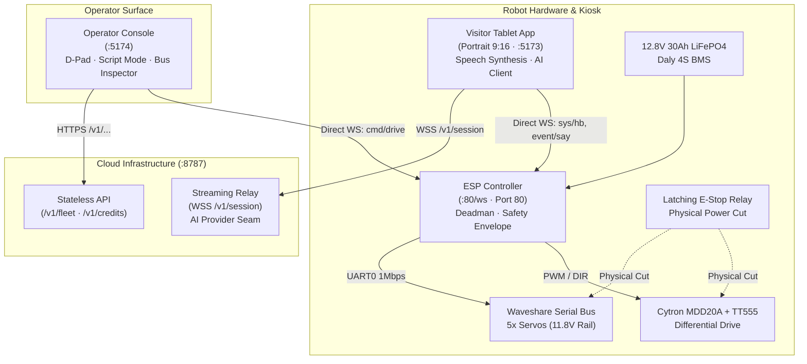

# System Requirements Specification (SRS)
## AT Bots V3 Lite Platform

**Document ID:** ATB-V3L-SRS-001  
**Version:** 2.0  
**Status:** Approved for Implementation & Release  
**Last Updated:** September 2026  
**Platform Remote:** `github.com/hxri-nxrxyxn/atbots-v3lite`

---

## 1. Introduction

### 1.1 Purpose
This System Requirements Specification (SRS) establishes the complete functional and non-functional requirements, architectural contracts, hardware interfaces, communication protocols, and operational safety boundaries for **AT Bots V3 Lite**. It serves as the definitive engineering specification for software, firmware, electronics, and UX development.

### 1.2 Scope
AT Bots V3 Lite is a 1.2 m tall, 25 kg wheeled interactive receptionist, host, and educational engagement platform. It operates as an embodied physical conversational interface positioned by human operators.

The system encompasses four core subsystems:
1. **Visitor Kiosk Tablet (`apps/tablet`)**: SvelteKit single-page application running in a locked portrait viewport (1200x2000 / 9:16 aspect ratio). Serves as the primary human-interaction surface, microphone input, face expression display, and text-to-speech audio emitter.
2. **Operator & Fleet Management Console (`apps/operator`)**: Unified SvelteKit single-page application providing low-latency local teleoperation, joint manual overrides, Script Mode broadcast, real-time WebSocket bus inspection, and cloud fleet telemetry/content management.
3. **Motion & Safety Controller (`firmware/esp8266` / ESP32)**: Dedicated MicroPython/C controller enforcing physical safety constraints, deadman keepalive failsafes, emergency stop sensing, differential drive PWM, and multi-client WebSocket topic broadcasting.
4. **Cloud Relay & Stateless API (`mock/cloud` & `packages/*`)**: Streaming relay broker managing AI natural language sessions, provider switching (Mock / OpenAI), delta content sync, and credit metering.

### 1.3 Key Architectural Decisions (ADRs)
- **ADR-01: Split Control Plane & Data Plane**: Physical motion control (Operator ↔ Robot) operates over direct local WebSocket (`ws://<ip>:80/ws`) with zero internet dependency (<15 ms latency). AI conversation runs over the cloud data plane (`wss://<relay>/v1/session`).
- **ADR-02: Named Sequences over Dynamic Joint Trajectories**: LLMs emit high-level named intents (`play_sequence("wave")`). Firmware validates joint limits locally in flash memory.
- **ADR-03: Half-Duplex Voice Architecture**: The microphone is strictly muted during speaker playback, eliminating acoustic echo cancellation (AEC) complexity and audio feedback loops.
- **ADR-04: Topic & Payload WebSocket Standardization**: Direct WebSocket messaging utilizes an MQTT-like `{ topic, payload, id, ts }` envelope with correlated request-response handshakes.

---

## 2. Overall System Architecture



---

## 3. Functional Requirements

### 3.1 Visitor Kiosk Tablet Application (`apps/tablet`)

| Requirement ID | Description | Verification Status |
|---|---|---|
| **REQ-TAB-001** | **Viewport Hierarchy**: The application MUST render in a strict 100dvh portrait layout with a top ~40vh hero canvas for face animation and peeking module tiles below the fold. | Verified |
| **REQ-TAB-002** | **Touch-to-Start**: Audio capture and AI streaming MUST initiate only upon explicit user touch interaction. Background listening is strictly prohibited. | Verified |
| **REQ-TAB-003** | **Natural Language Session**: Provide speech-to-text input (Web Speech API) with fallback typed input, canned prompt chips, and a tactile **Stop** button for instant speech interruption. | Verified |
| **REQ-TAB-004** | **Procedural Face Engine**: Render responsive SVG facial geometry supporting 12 emotional states with GSAP parameter tweening (0.4s `power2.out`), randomized eyelid blinking (2.5–5s), and speaking mouth oscillations. | Verified |
| **REQ-TAB-005** | **Offline Quizzes**: Offer structured interactive multi-choice quizzes with immediate tactile option selection, correct/incorrect feedback, spoken audio explanations, and final scorecard metrics. | Verified |
| **REQ-TAB-006** | **Guided Lessons Reader**: Provide multi-section technical reading modules with horizontal step switchers (`01`, `02`, `03`), section progress tracking, and read-aloud voice synthesis. | Verified |
| **REQ-TAB-007** | **Script Mode Interception**: Subscribe to `event/say` on the local ESP bus; upon broadcast, halt active audio, switch face expression to `speaking`, and vocalize the announcement. | Verified |
| **REQ-TAB-008** | **One-Time Commissioning Wizard**: If `localStorage` indicates uncommissioned status, enforce navigation to `/onboarding` layout to assign tenant code, robot call name, and run self-test diagnostics. | Verified |
| **REQ-TAB-009** | **On-Screen Keypad Dock**: Automatically present a compact, floating bottom-left virtual keypad (numeric 3x4 or QWERTY alphanumeric with Shift/Symbols) upon focusing form inputs. | Verified |
| **REQ-TAB-010** | **Scrollbar Suppression**: All viewports and scrollable panes MUST render with completely invisible scrollbars across all browsers while retaining touch scrollability. | Verified |

---

### 3.2 Operator Console Application (`apps/operator`)

| Requirement ID | Description | Verification Status |
|---|---|---|
| **REQ-OP-001** | **Hold-to-Move Teleoperation**: Drive buttons (`Forward`, `Backward`, `Left`, `Right`) MUST transmit motion commands only while physically held (`onpointerdown` → `cmd/drive`, `onpointerup` → `cmd/stop`). | Verified |
| **REQ-OP-002** | **Software Emergency Stop**: Provide a latching E-stop toggle in the global header that immediately sends `cmd/stop`, blocks drive dispatches, and emits `cmd/debug/estop`. | Verified |
| **REQ-OP-003** | **Script Mode Broadcasting**: Allow the operator to trigger predefined venue phrases or type custom text; dispatches `cmd/say` with correlated request IDs and awaits `res/ack`. | Verified |
| **REQ-OP-004** | **Live Signal Bus Inspector**: Display real-time bidirectional WebSocket packets (`TX`, `RX`, topic, message ID, JSON payload, millisecond timestamps) with instant `LAST TX`, `LAST RX`, and `HANDSHAKE` indicators. | Verified |
| **REQ-OP-005** | **Heartbeat Filter**: Provide a dedicated `Hide Heartbeats (sys/hb)` toggle to filter high-frequency 5 Hz keepalive frames from the diagnostic log stream. | Verified |
| **REQ-OP-006** | **Hardware Subsystems Monitoring**: Display live telemetry for Cytron MDD20A motor PWM duty cycles, Daly 4S BMS cell voltages, Waveshare 5-servo bus telemetry (angle, temperature, voltage), RP2350 link status, and GPIO interlocks. | Verified |
| **REQ-OP-007** | **Component Debug Toggles**: Allow individual manual pulsing of left/right drive wheels and discrete positioning (`-45°`, `0°`, `+45°`) of individual serial bus servos. | Verified |
| **REQ-OP-008** | **Cloud Fleet Dashboard**: List managed robots with live battery, firmware, and status indicators (`active`, `suspended`, `revoked`), with remote restart/suspend actions. | Verified |
| **REQ-OP-009** | **Credit & Session Accounting**: Display live credit balances, burn rates, projected run-out dates, and per-session transaction logs. | Verified |

---

### 3.3 Robot Controller Firmware (`firmware/esp8266` / ESP32)

| Requirement ID | Description | Verification Status |
|---|---|---|
| **REQ-FW-001** | **Multi-Client Concurrency**: Maintain an asynchronous non-blocking `select()` loop handling up to 4 concurrent WebSocket clients (tablet, operator, diagnostic tools). | Verified |
| **REQ-FW-002** | **Deadman Failsafe**: If no `sys/hb` or `cmd/drive` message is received from any client within 500 ms, immediately ramp motor velocity to zero and broadcast `{ topic: 'event/deadman', payload: { state: 'stopped' } }`. | Verified |
| **REQ-FW-003** | **Topic & Payload Protocol**: Parse and validate incoming frames matching the standardized schema; echo request IDs in all `res/ack` and `res/nack` responses. | Verified |
| **REQ-FW-004** | **Announcement Fanout**: Upon receiving `cmd/say`, acknowledge the sender with `res/ack` and broadcast `{ topic: 'event/say', payload: { text } }` to all connected clients. | Verified |
| **REQ-FW-005** | **Periodic Telemetry**: Broadcast `{ topic: 'telemetry', payload: { ... } }` to all active WebSocket clients at a fixed 1 Hz rate. | Verified |
| **REQ-FW-006** | **Memory Stability**: Execute `gc.collect()` on every telemetry tick to keep free RAM flat (~25 KB free heap) and avoid memory fragmentation. | Verified |
| **REQ-FW-007** | **HTTP Status Endpoint**: Serve `GET /status` returning JSON machine state, IP address, and free memory for local network diagnostics. | Verified |

---

## 4. Communication Protocol Specification

### 4.1 Topic Envelope Format
All messages transmitted over `ws://<robot-ip>/ws` adhere to the standardized envelope:

```typescript
interface Envelope<TTopic extends string, TPayload> {
  topic: TTopic;       // Topic identifier
  payload: TPayload;   // Strongly-typed data payload
  id?: string;         // Correlated request/response ID
  ts?: number;         // Epoch timestamp in milliseconds
}
```

### 4.2 Topic Register

```
Topic Namespace
├── sys/
│   ├── hello                [ESP -> Client] Initial connection greeting & hardware profile
│   └── hb                   [Client -> ESP] 5 Hz keepalive heartbeat
├── cmd/
│   ├── drive                [Client -> ESP] Hold-to-move differential speed command
│   ├── stop                 [Client -> ESP] Immediate motor halt
│   ├── expression           [Client -> ESP] Set active facial emotion
│   ├── speaking             [Client -> ESP] Toggle speech mouth animation state
│   ├── say                  [Client -> ESP] Script Mode announcement text
│   ├── sequence             [Client -> ESP] Trigger named motion sequence (e.g. 'wave')
│   ├── home                 [Client -> ESP] Return all servos to home zero pose
│   └── debug/
│       ├── motor            [Client -> ESP] Direct pulse left/right motor
│       ├── servo            [Client -> ESP] Direct angle override for servo ID
│       └── estop            [Client -> ESP] Software E-stop toggle
├── res/
│   ├── hb_ack               [ESP -> Client] Heartbeat sequence confirmation
│   ├── ack                  [ESP -> Client] Correlated command acknowledgment
│   └── nack                 [ESP -> Client] Correlated command rejection
└── event/
    ├── say                  [ESP -> All]    Broadcast announcement text to speech clients
    ├── deadman              [ESP -> All]    Failsafe stop notification
    ├── estop                [ESP -> All]    Emergency stop state notification
    └── fault                [ESP -> All]    Hardware subsystem fault alert
```

---

## 5. Non-Functional Requirements

### 5.1 Performance & Timing
- **REQ-NFR-001 (Teleop Latency)**: Control press (`cmd/drive`) to motor actuation latency MUST be **< 20 ms** over local Wi-Fi.
- **REQ-NFR-002 (Deadman Cutoff)**: Physical drive cutoff MUST engage within **500 ms ± 20 ms** of signal loss.
- **REQ-NFR-003 (Face Animation Frame Rate)**: Procedural face animations MUST render consistently at **60 FPS** without frame drops or layout thrashing.
- **REQ-NFR-004 (Cold Boot Time)**: Firmware MUST be listening on WebSocket within **< 3 seconds** of power application; tablet UI ready within **< 30 seconds**.

### 5.2 Safety & Interlocks
- **REQ-NFR-010 (Physical E-Stop)**: A physical latching emergency stop button (22 mm NC mushroom) MUST cut battery power to motor drivers and servo rails via a 40A automotive relay, completely independent of processor state.
- **REQ-NFR-011 (Charger Interlock)**: Hardware sense on GPIO10 MUST inhibit all drive motion commands whenever the YM-20 charge connector is energized (14.6V).
- **REQ-NFR-012 (Servo Voltage Rail Limit)**: Servos MUST be powered from a dedicated buck converter strictly regulated to **11.5–12.0 V** (ST3215 maximum rated input is 12.6V; pack reaches 14.6V during charge).

### 5.3 User Experience & Design Language
- **REQ-NFR-020 (Design System)**: The user interface MUST strictly follow the established monochrome/amber brand design language (`--brand: oklch(0.8 0.12 72)`, `--background: oklch(0.145 0 0)`, `--card: oklch(0.205 0 0)`).
- **REQ-NFR-021 (Anti-Slop Standard)**: Decorative badge chips, pill tags, and uppercase letter-spaced micro-tags are strictly prohibited. Typography must adhere to clean document hierarchy (`font-semibold tracking-tight`, `text-sm text-muted-foreground`).
- **REQ-NFR-022 (Reduced Motion)**: All GSAP animations MUST respect `prefers-reduced-motion` settings via `gsap.matchMedia()`.

---

## 6. Verification Matrix

| Component | Test Mechanism | Target Benchmark | Status |
|---|---|---|---|
| **Protocol Envelopes** | Vitest (`guards.test.ts`) | 100% schema match & rejection of malformed packets | **Passed** |
| **Link Correlated Handshakes** | Vitest (`mock-esp-link.test.ts`) | Promises resolve with matching ID; timeouts on silence | **Passed** |
| **Firmware Control Plane** | Hardware Probe (`test_all_esp.py`) | 12/12 test cases passing on live ESP8266 (`192.168.0.155`) | **Passed** |
| **Tablet Kiosk App** | SvelteKit (`svelte-check`) | 0 TypeScript errors, 0 warnings across all routes | **Passed** |
| **Operator App** | SvelteKit (`svelte-check`) | 0 TypeScript errors, 0 warnings across all routes | **Passed** |
| **CSS Bundle Assets** | Vite Build (`npm run build`) | Single JS/CSS bundle; scrollbars suppressed globally | **Passed** |
