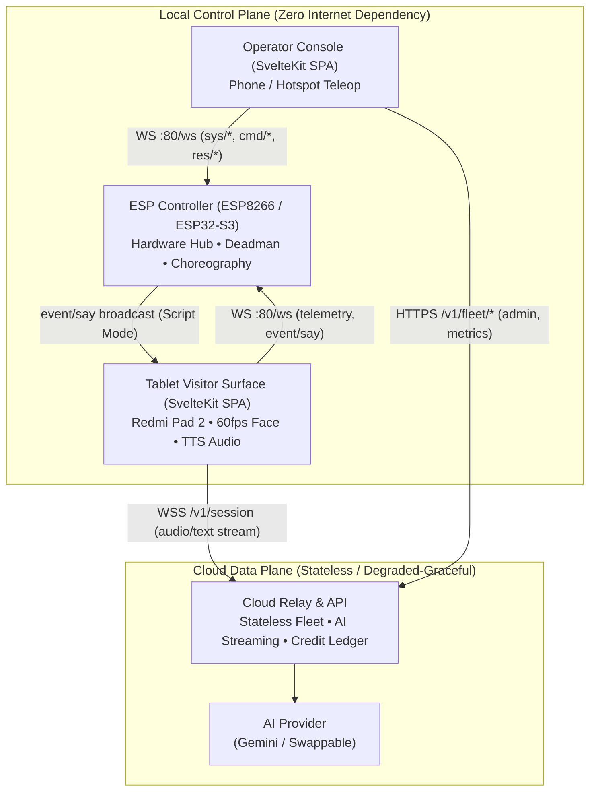
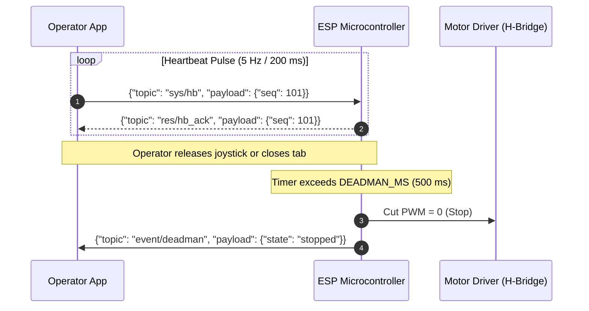

# Engineering Thinking & Architectural Rationale

> **AT Bots V3 Lite** — The philosophy, opinionated stack decisions, protocol design, and safety invariants behind a commercial interactive robotic kiosk.

---

## 1. Executive Thesis: Why This Stack Exists

AT Bots V3 Lite is a **1.2-meter tall, 25-kilogram wheeled robot** designed to operate in high-density, unpredictable human environments: school corridors, retail reception venues in Saudi Arabia, and luxury event halls / weddings.

Most robotics software stacks fail in these environments for a predictable reason: **over-engineering the wrong layers while neglecting commercial and operational realities.** 

Teams commonly jump to ROS2, run heavy Linux SBCs (e.g. Jetson Orin / Raspberry Pi 5) drawing 30–50W, load fragile SLAM navigation stacks that get confused by evening gown hemlines or crowd density, and tether safety-critical teleoperation to internet cloud relays. When the venue Wi-Fi drops at a wedding, the robot freezes or runs away; when an OTA package update corrupts a dynamic link library on the SBC, the robot is bricked on-site.

AT Bots V3 Lite takes an uncompromising, highly opinionated counter-stance:



### The Five Axioms That Shaped Every Line of Code

1. **No Autonomy by Design:** There is no SLAM, no LIDAR, no IMU, and no camera-based autonomous path planning. The robot is stationary during visitor conversation. When it needs to reposition across a venue, a human operator drives it via local teleop. Removing autonomy eliminates 80% of system failure modes, eliminates thermal runaways, and cuts hardware BOM cost radically.
2. **Local Control Plane, Never Cloud:** Drive controls, e-stops, heartbeats, and script announcements operate entirely over the local venue subnet or a direct Wi-Fi hotspot (`ws://<board-ip>/ws`). If the venue’s ISP fails, teleop and robot safety remain 100% operational.
3. **The LLM Chooses Intent, Never Motion:** Large language models hallucinate; hardware should never tolerate hallucinations. The AI model emits named semantic sequences (e.g., `play_sequence("welcome_wave")`). The local microcontroller owns physical joint limits, acceleration ramps, and servo actuation.
4. **Touch-to-Start Over Always-Listening:** The robot is an intentional kiosk, not an ambient smart speaker. The visitor taps a button on the chest tablet to engage. This eliminates the acoustic echo cancellation (AEC) nightmare of 1.5-meter open microphones in loud event halls, yields deterministic credit metering, and preserves privacy.
5. **Cost is the Product:** Cloud AI inference costs are billed back with margin. Metering and credit limits are not cosmetic dashboard features; they are hard gates integrated into session initialization.

---

## 2. Protocol Architecture (`packages/protocol`)

The communication contract between clients (Tablet & Operator) and the microcontroller (ESP) is defined in a single source of truth: [`packages/protocol`](packages/protocol/src/messages.ts).

### Why Topic & Payload JSON Over WebSockets?

Instead of adopting socket.io, gRPC-Web, raw binary frames, or ad-hoc HTTP polling, we engineered an **MQTT-style Topic & Payload envelope**:

```typescript
export interface BaseEnvelope<TTopic extends string, TPayload> {
    topic: TTopic;
    payload: TPayload;
    id?: string;   // Correlated Request-Response ID
    ts?: number;   // Epoch millisecond timestamp
}
```

#### The Technical Rationale:
- **MicroPython & Low-RAM Microcontrollers:** The bench prototype runs on an ESP8266 with only **~25–30 KB of usable heap**. Binary decoders (Protobuf/FlatBuffers) require native C-bindings or generate large object allocations that fragment micro-heaps. Minimal JSON payloads parsed with standard streaming readers and explicit garbage collection (`gc.collect()`) run reliably for days without memory leakage.
- **Observability Without External Tools:** Because payloads are UTF-8 JSON text frames, any developer or field technician can debug the robot in real-time using Chrome DevTools Network Tab, `websocat`, or standard Python test probes ([`firmware/esp8266/tools/ws_probe.py`](firmware/esp8266/tools/ws_probe.py)).
- **Hierarchical Topic Namespaces:** Topics are namespaced by intent:
  - `sys/*`: System lifecycle (`sys/hello`, `sys/hb`)
  - `cmd/*`: Imperative operator actions (`cmd/drive`, `cmd/stop`, `cmd/say`, `cmd/sequence`)
  - `res/*`: Correlated acknowledgments (`res/ack`, `res/nack`, `res/hb_ack`)
  - `event/*`: Asynchronous system events (`event/deadman`, `event/estop`, `event/say`)
  - `telemetry`: Periodic broadcast state

### Correlated Request-Response Handshakes

Standard WebSockets are full-duplex fire-and-forget streams. If a client transmits a drive command, it cannot natively discern if the motor controller received, parsed, or executed it. 

To solve this without adding HTTP overhead:
1. When calling `link.request('cmd/drive', { dir: 'forward', speed: 5 })`, the client injects a unique correlation ID: `req_<seq>_<timestamp>`.
2. The ESP evaluates hardware states (verifies E-Stop is inactive, validates ranges) and returns a matching `res/ack` or `res/nack` referencing that specific `id`.
3. If the ESP rejects the command (e.g., E-Stop active), it yields a `res/nack` with a typed reason (`estop_active`), rejecting the client-side Promise immediately.
4. If no response returns within `timeoutMs` (default 3000ms), the Promise rejects with a clear timeout exception, surfacing network disconnects instantly.

### The Deadman Failsafe System

For a 25kg robot, motor safety is an uncompromising physical requirement.



- **5 Hz Heartbeat (`sys/hb` @ 200ms):** The active operator client transmits regular heartbeats while controlling the robot.
- **500ms Deadman Window (`DEADMAN_MS`):** If network latency spikes, the operator's phone locks, or the browser tab is background-throttled by mobile OS power management, the ESP timer exceeds 500ms.
- **Zero-Trust Hard Stop:** The microcontroller immediately drives motor PWM to zero, clears drive states, and broadcasts `event/deadman` across all attached WebSockets. Motion cannot resume until a valid command arrives.

### Hub-and-Spoke "Script Mode"

In corporate exhibitions or wedding hosting, an off-stage operator often wants the robot to make tailored announcements without speaking directly into a microphone. 

Instead of building a peer-to-peer WebRTC mesh between the operator's phone and the tablet:
1. Operator inputs text in [`apps/operator/src/routes/script`](apps/operator/src/routes/script/+page.svelte).
2. Operator console dispatches `cmd/say` with `{ text: "Welcome to the gala" }` to the ESP over WebSocket.
3. The ESP acknowledges the command (`res/ack`) and acts as the local message broker, broadcasting `event/say` to **all** connected clients.
4. The tablet visitor app listens for `event/say` on the local link, catches the payload, and immediately routes the text to its speech synthesis engine.
5. The robot speaks the line with mouth visemes animating in real-time.

---

## 3. Link Layer Abstraction (`packages/link`)

Hardware is not always on the developer's desk. Designing frontend applications that hardcode direct WebSocket connections leads to broken dev cycles and mock drift.

[`packages/link`](packages/link/src/esp-link.ts) establishes the `EspLink` interface:

```typescript
export interface EspLink {
    readonly status: LinkStatus;
    connect(): void;
    disconnect(): void;
    send(message: ClientMessage): void;
    request<TTopic extends ClientTopic>(
        topic: TTopic, 
        payload: ExtractClientPayload<TTopic>, 
        timeoutMs?: number
    ): Promise<ResAckMessage['payload']>;
    onMessage(handler: (message: EspMessage) => void): () => void;
    onTopic<TTopic extends EspTopic>(topic: TTopic | string, handler: (payload: ExtractPayload<TTopic>, message: EspMessage) => void): () => void;
    onStatus(handler: (status: LinkStatus) => void): () => void;
    onTrace?(handler: (trace: PacketTrace) => void): () => void;
}
```

### Dual Implementations: Zero Hardware Friction

1. **`WebSocketEspLink`:** Connects to the physical robot over native RFC 6455 WebSockets. Handles auto-reconnect backoff, queued outgoing messages while connecting, heartbeat timers, and wildcard topic dispatch (`event/*`).
2. **`MockEspLink`:** An in-memory, deterministic robot simulator running directly in the browser or Vitest suite. It emulates 1 Hz telemetry intervals, deadman timeout triggers when heartbeats halt, sequence execution delays, and correlated ACK/NACK responses.

Frontend engineers can develop, polish, and test the entire tablet and operator experience on a train or airplane without powering a single motor.

---

## 4. Frontend Philosophy: Svelte 5 Runes & The Tablet Kiosk

Both frontends ([`apps/tablet`](apps/tablet) and [`apps/operator`](apps/operator)) are built on **Svelte 5** and **Tailwind CSS v4**.

### Why Svelte 5 Over React or Vue?

A visitor tablet is an embedded touch kiosk running on an entry-level Android tablet (e.g. Redmi Pad 2, 4GB RAM, MediaTek Helio G99). 

- **Virtual DOM Overhead:** In React, running continuous 60fps SVG canvas animations, 5Hz telemetry state updates, and speech recognition events triggers frequent reconciliation cycles, leading to micro-stutters and frame drops.
- **Svelte 5 Runes (`$state`, `$derived`, `$effect`, `$props`):** Svelte 5 compiles away the framework. Reactivity is fine-grained down to specific DOM nodes without virtual DOM diffing. When telemetry arrives at 1 Hz or battery voltage ticks down, only the exact numeric text node in the DOM updates.
- **Zero Legacy Svelte 3/4 Stores:** We use pure universal reactive state objects (`RobotStore`, `KeypadStore`, `KeyboardStore`) written in TypeScript `.svelte.ts` files, making state management clean, type-safe, and decoupled from component markup.

### SvelteKit in Pure SPA Mode

```typescript
// apps/tablet/src/routes/+layout.ts
export const ssr = false;
export const prerender = false;
```

Both apps use `@sveltejs/adapter-static` with an `index.html` fallback and `bundleStrategy: 'single'`.
- There is **no Node.js server runtime** on the robot tablet.
- Pages load instantly from local storage or flash cache.
- The compiled bundle is 100% static HTML/CSS/JS, ready to be wrapped in Android WebView or Capacitor kiosk shells.

### Procedural SVG Face Animation (`Face.svelte`)

The robot's face is rendered as procedural scalable vector graphics (SVG) with GSAP tweening:

```
[ Brow Tilt / Y Offset ]
    ( Eye Open Ratio )        ( Eye Open Ratio )
              \                      /
               \___ Saccadic Drift _/
                         |
                 [ Mouth Curve / Open ]
```

- **Natural Micro-Behaviors:** Background `$effect` loops drive randomized human-like blinks (every 2.6–5.0 seconds) and procedural organic gaze drifts.
- **Viseme Mouth Movement:** When the robot speaks (`speaking = true`), sinusoidal phase oscillators modulate mouth open/curve values in real-time, syncing to audio output.
- **Reduced Motion Support:** Fully honors `prefers-reduced-motion: reduce`, dropping easing tweens for instant step transitions to accommodate sensitive users or conserve GPU cycles.

### Kiosk UX: Virtual Keyboards Over Native OS Popups

On physical Android kiosks, native OS soft-keyboards are notoriously problematic:
- They resize the web viewport, triggering layout breakage and sticky element jumps.
- In fullscreen kiosk WebView mode, Android can drop focus or hide inputs behind the keyboard.
- OS keyboards expose system shortcuts, emoji pickers, and settings gears that allow visitors to break out of the kiosk app.

**Our Solution:** Custom in-app virtual input systems ([`KeyboardDock.svelte`](apps/tablet/src/lib/components/KeyboardDock.svelte), [`NumericInput.svelte`](apps/tablet/src/lib/components/NumericInput.svelte), [`VirtualInput.svelte`](apps/tablet/src/lib/components/VirtualInput.svelte)).
- Full alphanumeric touch docks and PIN security keypads are rendered within the DOM.
- Absolute layout predictability: the viewport height never shifts.
- Physical kiosk touch targets are calibrated for finger taps (min 48px height, tactile active states).

### Zero "AI Slop" Design System

The visual design follows a disciplined industrial aesthetic:
- **Palette:** Monochrome base (`--background: #09090b`, `--card: #18181b`, `--border: #27272a`) with a deliberate warm amber accent (`--brand: #f59e0b`).
- **Typography:** Strict, clean editorial hierarchy using `font-semibold tracking-tight` and `text-sm text-muted-foreground`.
- **Restraint:** **No decorative pill tags, no rainbow gradient badges, no neon micro-chips, and no AI-generated template fluff.** Every UI element is tactile, intentional, and functional.

---

## 5. Firmware Engineering (`firmware/esp8266`)

The bench microcontroller prototype runs on MicroPython on an ESP8266. Writing reliable networking code on an architecture with under 30KB of heap requires defensive low-level engineering:

```python
# firmware/esp8266/server.py
MAX_BUFFER = 1024
DEADMAN_MS = 500
TELEMETRY_MS = 1000

while True:
    socks = [srv] + [client["sock"] for client in clients]
    ready, _, _ = select.select(socks, [], [], 0.2)
    now = now_ms()
    ...
    # Hard deadman trip
    if STATE["drive"] != "stop" and diff_ms(now, last_hb) > DEADMAN_MS:
        STATE["drive"] = "stop"
        STATE["speed"] = 0
        broadcast({"topic": "event/deadman", "payload": {"state": "stopped"}})

    # Controlled telemetry tick + periodic GC
    if diff_ms(now, last_tel) > TELEMETRY_MS:
        last_tel = now
        gc.collect()
        broadcast(telemetry())
```

### Key Firmware Design Invariants:
1. **Non-Blocking Single-Threaded Event Loop:** Uses POSIX `select.select()` with a 200ms timeout over the server listening socket and all active client connections. No threads, no async coroutine overhead, zero race conditions.
2. **Memory Ceiling & Buffer Capping:** WebSocket buffers are capped at `MAX_BUFFER = 1024` bytes. Malformed or oversized frames immediately drop the socket before allocating heap memory.
3. **Deterministic Garbage Collection:** MicroPython's garbage collector can trigger unpredictably during allocations. By explicitly calling `gc.collect()` at the conclusion of every 1 Hz telemetry push, memory fragmentation is neutralized, keeping free memory flat at ~25,000 bytes.
4. **Embedded Frame Parser:** [`firmware/esp8266/ws.py`](firmware/esp8266/ws.py) implements the RFC 6455 WebSocket framing specification (Opcode parsing, client mask unmasking, and SHA-1/Base64 handshake calculation) in ~100 lines of pure Python.

---

## 6. Cloud & AI Data Plane (`mock/cloud`)

The cloud tier is cleanly isolated from the real-time physical control loop. It is composed of a stateless REST API for fleet management and a WebSocket relay for conversational AI sessions.

### Why a Cloud Relay Instead of Direct Client-to-LLM?

```
Visitor Tablet  ───>  Mock / Cloud Relay  ───>  AI Provider (Gemini / OpenAI)
    (Client)             (Security Guard)                   (LLM)
```

1. **Security Isolation:** API keys for LLM providers (e.g. Google Gemini, OpenAI) **never touch the tablet or client bundle**. A visitor inspecting the browser storage or APK bundle cannot extract commercial keys.
2. **Provider Agnostic Architecture (`AIProvider`):** [`mock/cloud/src/ai`](mock/cloud/src/ai) specifies a simple pluggable interface. The system switches between `MockProvider` (instant canned responses for offline testing), `GeminiProvider` (production multi-modal streaming), and `RealProvider` via the `AI_PROVIDER` environment variable without changing client code.
3. **Turn-Based Session Metering:** The cloud relay tracks `session.start`, token usage, audio chunks, and tool invocations, directly enforcing balance deductions before issuing downstream API calls.

---

## 7. Developer Experience & Monorepo Architecture

The repository is structured as an npm workspace monorepo:

```
├── apps/
│   ├── tablet/          # Visitor-facing SvelteKit SPA (:5173)
│   └── operator/        # Operator console SvelteKit SPA (:5174)
├── packages/
│   ├── protocol/        # Message shapes, guards, constants (TypeScript)
│   └── link/            # EspLink, WebSocketEspLink, MockEspLink
├── mock/
│   ├── esp/             # Node.js WebSocket robot simulator (:8765)
│   └── cloud/           # Node.js AI relay & fleet API (:8787)
├── firmware/
│   └── esp8266/         # MicroPython bench server
└── docs/                # Architectural specifications & ICDs
```

### Zero-Build Internal Packages
In traditional TypeScript monorepos, internal packages require separate compilation steps (`tsc -b` or Rollup), resulting in stale artifacts, watch-mode race conditions, and developer confusion.

In AT Bots V3 Lite:
- `packages/protocol` and `packages/link` export their raw TypeScript sources (`"exports": "./src/index.ts"`).
- Vite, SvelteKit, Vitest, and `tsx` consume the raw TypeScript directly.
- **Zero build steps for packages.** Change a protocol type in `messages.ts`, and the tablet app, operator console, and Vitest test runner update instantly with zero build latency.

### One-Command Full Stack Orchestration
Running four concurrent microservices (tablet frontend, operator frontend, mock cloud server, and mock robot simulator) is unified into a single command:

```bash
npm run dev:all
```

Orchestrated via [`scripts/dev-all.js`](scripts/dev-all.js), this boots all four processes in parallel with clean, color-coded log prefixing and handles graceful SIGINT/SIGTERM teardown.

---

## 8. Summary: Why This System is Bulletproof

| Threat / Real-World Hazard | Traditional Fragile Stack | AT Bots V3 Lite Architecture |
|---|---|---|
| **Venue Wi-Fi drops mid-event** | Cloud teleop disconnects; robot is frozen or runaway | Local ESP Wi-Fi control continues uninterrupted |
| **Operator closes phone or locks screen** | Motor continues spinning last received vector | ESP Deadman timer halts motors in 500ms |
| **Crowded venue with background noise** | 1.5m open-mic triggers acoustic feedback & false prompts | Touch-to-Start kiosk UX with arm's-length pickup |
| **Low-cost tablet runs out of memory** | React virtual DOM tree thrashing drops frames | Svelte 5 compiled runes yield lightweight 60fps |
| **Microcontroller heap fragmentation** | MicroPython crashes with `MemoryError` after 20 mins | 1024-byte buffer caps + explicit 1Hz `gc.collect()` |
| **LLM produces invalid motion coordinates** | Servo joints slam into mechanical stops | Microcontroller validates named sequences against hard limits |
| **Visitor inspects tablet code bundle** | Cloud AI API keys stolen and drained | Keys reside strictly on Cloud Relay; zero client secrets |

AT Bots V3 Lite proves that building a robust commercial robot does not require complex distributed systems or brittle autonomous stacks. By establishing clear boundaries, enforcing hard safety invariants in firmware, and selecting high-performance, lightweight web technologies, we delivered a system that is fast, deterministic, and dependable under real-world conditions.
